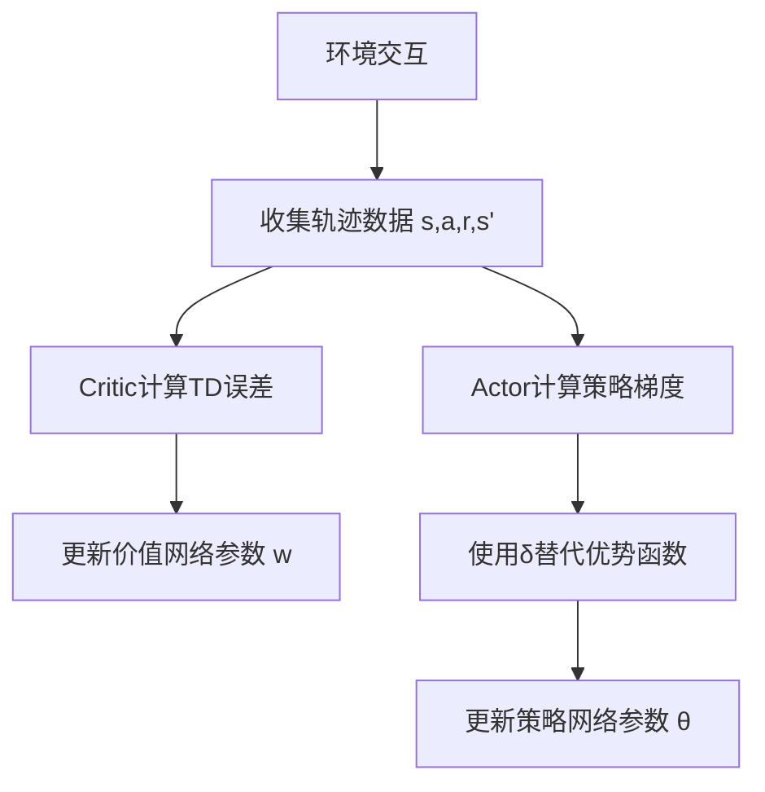

一种特别的方法，上述两者的结合，Actor会基于概率作出动作，Critic会根据作出的动作打分，是一类结合了策略评估（Critic）和策略改进（Actor）的强化学习算法。它们通过同时学习一个策略函数（Actor）和一个值函数（Critic），从而可以更有效地学习到优秀的策略；A2C (Advantage Actor-Critic)、A3C (Asynchronous Advantage Actor-Critic)、DDPG (Deep Deterministic Policy Gradient)、TD3 (Twin Delayed Deep Deterministic Policy Gradient)、PPO (Proximal Policy Optimization)等算法均是Actor-Critic方法
————————————————

                            版权声明：本文为博主原创文章，遵循 CC 4.0 BY-SA 版权协议，转载请附上原文出处链接和本声明。

原文链接：https://blog.csdn.net/Ever_____/article/details/133362585

## Actor-Critic 算法详解

---

### 核心思想

Actor-Critic 是一种结合策略梯度（[[Policy Gradient]]）和价值函数（[[Value Function]]）的强化学习框架：

- **Actor**：策略网络 $\pi_\theta(a|s)$，负责生成动作
- **Critic**：价值网络 $V_w(s)$，评估状态价值
  通过两者的交互实现**策略优化**与**价值评估**的协同提升。

---

### 数学基础

#### 1. 策略梯度定理

策略目标函数梯度：

$$
\nabla J(\theta) = \mathbb{E}_{s \sim d^\pi, a \sim \pi_\theta} \left[ \nabla_\theta \log \pi_\theta(a|s) \cdot Q^\pi(s,a) \right]
$$

其中：

- $d^\pi$ 是策略 $\pi$ 的稳态状态分布
- $Q^\pi(s,a)$ 是状态-动作价值函数

#### 2. 优势函数（Advantage Function）

定义优势函数为：

$$
A^\pi(s,a) = Q^\pi(s,a) - V^\pi(s)
$$

将策略梯度改写为：

$$
\nabla J(\theta) = \mathbb{E} \left[ \nabla_\theta \log \pi_\theta(a|s) \cdot A^\pi(s,a) \right]
$$

#### 3. TD误差（Temporal Difference Error）

Critic 的更新目标：

$$
\delta_t = r_t + \gamma V_w(s_{t+1}) - V_w(s_t)
$$

通过最小化均方误差更新价值网络：

$$
L(w) = \frac{1}{2} \mathbb{E} \left[ \delta_t^2 \right]
$$

---

### 算法流程



#### 具体步骤：

1. **采样阶段**：使用当前策略 $\pi_\theta$ 与环境交互，收集轨迹数据 $(s_t,a_t,r_t,s_{t+1})$

2. **Critic更新**：
   
   $$
   w \leftarrow w + \alpha_w \delta_t \nabla_w V_w(s_t)
   $$

3. **Actor更新**：
   
   $$
   \theta \leftarrow \theta + \alpha_\theta \nabla_\theta \log \pi_\theta(a_t|s_t) \cdot \delta_t
   $$

---

### 代码实现示例（PyTorch）

```python
import torch
import torch.nn as nn
import torch.optim as optim

class Actor(nn.Module):
    def __init__(self, state_dim, action_dim):
        super().__init__()
        self.fc = nn.Sequential(
            nn.Linear(state_dim, 64),
            nn.ReLU(),
            nn.Linear(64, action_dim),
            nn.Softmax(dim=-1)
        )

    def forward(self, s):
        return self.fc(s)

class Critic(nn.Module):
    def __init__(self, state_dim):
        super().__init__()
        self.fc = nn.Sequential(
            nn.Linear(state_dim, 64),
            nn.ReLU(),
            nn.Linear(64, 1)
        )

    def forward(self, s):
        return self.fc(s)

# 初始化网络
actor = Actor(state_dim=4, action_dim=2)
critic = Critic(state_dim=4)
optimizer_actor = optim.Adam(actor.parameters(), lr=1e-3)
optimizer_critic = optim.Adam(critic.parameters(), lr=1e-2)

# 训练步骤
def update(s, a, r, s_next, done):
    # Critic 更新
    v_current = critic(s)
    v_next = critic(s_next) * (1 - done)
    td_error = r + 0.99 * v_next - v_current
    loss_critic = td_error.pow(2).mean()

    optimizer_critic.zero_grad()
    loss_critic.backward()
    optimizer_critic.step()

    # Actor 更新
    prob = actor(s).gather(1, a.unsqueeze(1))
    loss_actor = -torch.log(prob) * td_error.detach()

    optimizer_actor.zero_grad()
    loss_actor.mean().backward()
    optimizer_actor.step()
```

---

### 关键改进方法

#### 1. 异步优势Actor-Critic（A3C）

- 多个智能体并行采集数据

- 使用优势函数估计：
  
  $$
  A_t = \sum_{i=0}^{k-1} \gamma^i r_{t+i} + \gamma^k V_w(s_{t+k}) - V_w(s_t)
  $$

#### 2. 软更新（Soft Update）

用于目标网络参数更新：

$$
w_{target} \leftarrow \tau w + (1-\tau)w_{target} \quad (0 < \tau \ll 1)
$$

#### 3. 熵正则化

在损失函数中添加熵项促进探索：

$$
L_{actor} = \mathbb{E} \left[ -\log \pi(a|s) \delta \right] - \beta \mathbb{H}(\pi(\cdot|s))
$$

---

### 与其他算法的对比

| 算法               | 是否需要价值网络 | 策略类型   | 适用场景    |
| ---------------- | -------- | ------ | ------- |
| Q-learning       | 不需要      | 确定性策略  | 离散动作空间  |
| DDPG             | 需要       | 确定性策略  | 连续动作空间  |
| REINFORCE        | 不需要      | 随机策略   | 简单环境    |
| **Actor-Critic** | 需要       | 随机/确定性 | 中高维复杂环境 |

---

### 注意事项

1. **偏差-方差权衡**：
   
   - 使用TD误差会引入偏差但降低方差
   - 使用蒙特卡洛回报（完整轨迹）无偏但方差大

2. **探索与利用平衡**：
   
   - 初始阶段设置较大熵系数 $\beta$
   - 随训练过程逐步衰减 $\beta$

3. **学习率设置**：
   
   - 通常 Critic 的学习率（1e-2）应大于 Actor（1e-3）
   - 可采用自适应方法如Adam优化器

4. **经验回放**：
   建议使用优先经验回放（Prioritized Experience Replay）：
   
   $$
   P(i) = \frac{|\delta_i|^\alpha}{\sum_j |\delta_j|^\alpha}
   $$

---

### 总结

Actor-Critic 算法通过：

- ✅ 同时学习策略与价值函数
- ✅ 降低策略梯度的方差
- ✅ 支持连续动作空间
- ✅ 实现更稳定的训练过程

其核心优势在于将策略评估（Critic）与策略改进（Actor）解耦，成为深度强化学习中最主流的框架之一。后续发展的DDPG、PPO、SAC等算法均建立在此基础之上。